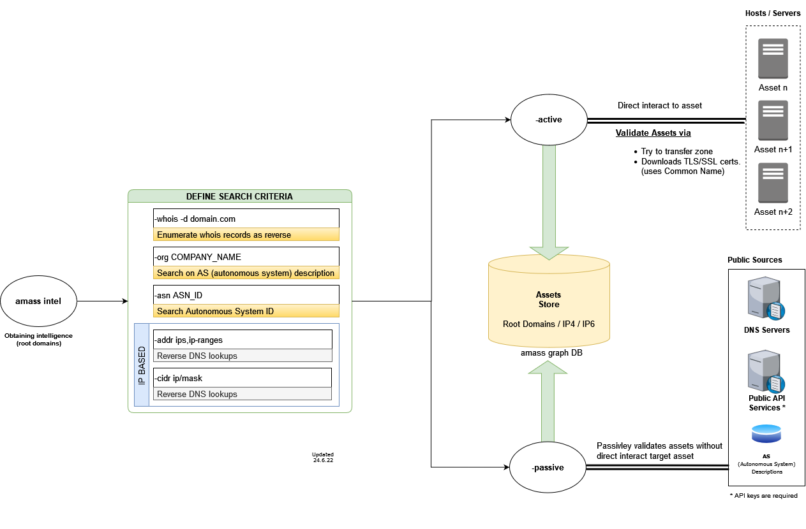
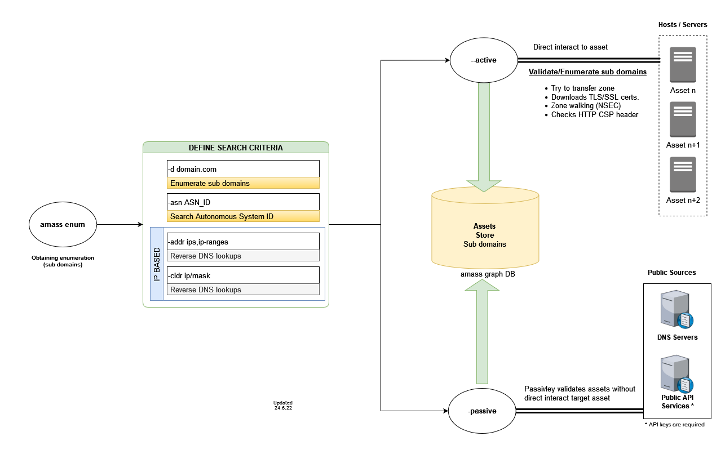

# Amass Working Diagrams
I made a visual representation of amass subcommands for new users. I am also a new amass user. Therefore, the presentation may contain technical and logical mistakes. If you have any corrections and suggestions to improve this repository I would be very happy to hear. I made the drawings of the schematics using draw.io (https://draw.io). You can use the amass-diagram.drawio file I shared to review the drawings. Viewing the drawings is very simple. Go to draw.io and upload the drawing file. Below are the images of the final drawings. I hope it will be useful to amass community. I also shared a guide that I prepared in my native language (Turkish) on my blog (http://www.tankado.com/owast-amass-domain-istihbarat-araci/).

